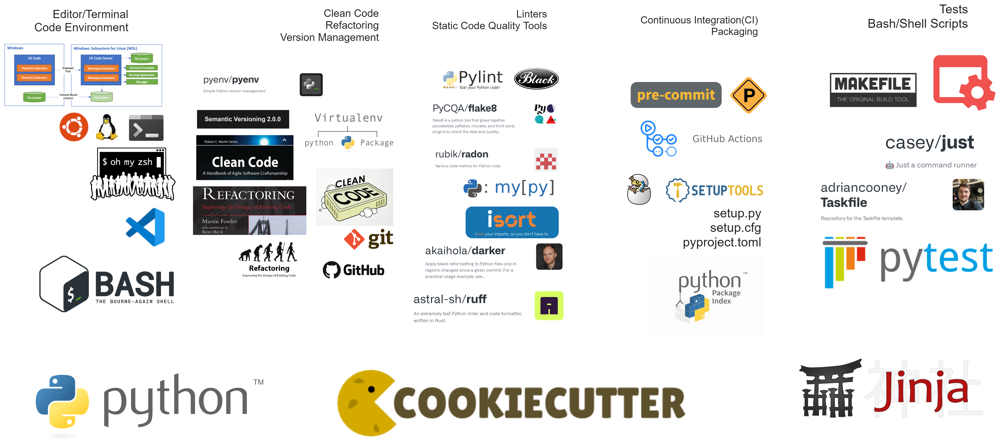
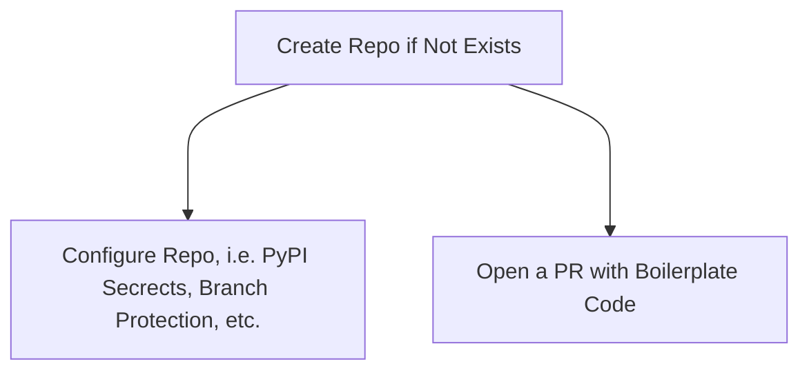

## Tools used in the Project

## Github Actions Workflow to Create a New Repo and Populate it with Boilerplate Code

```mermaid
graph TD;
    A[Create Repo if Not Exists] ---> B[Configure Repo, i.e. PyPI Secrects, Branch Protection, etc.]
    A ---> C[Open a PR with Boilerplate Code]
```
