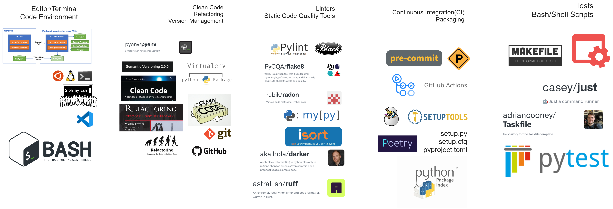
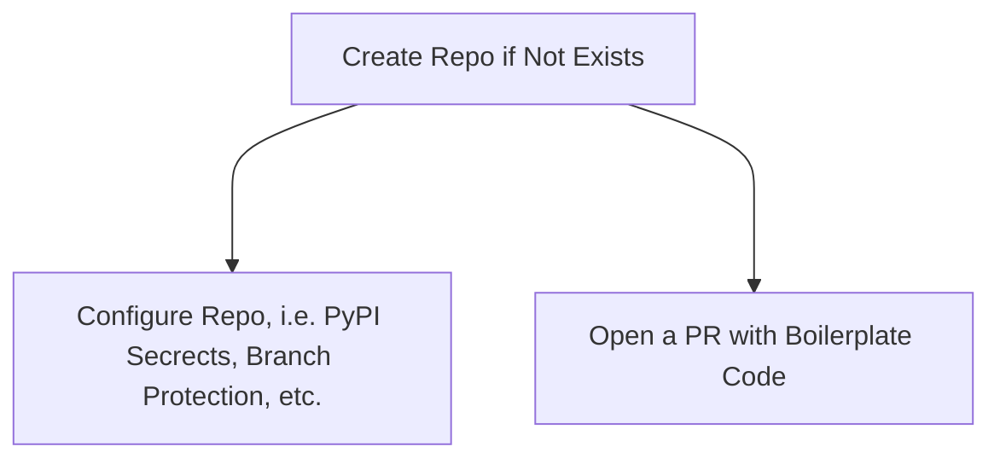

## @TODO:
- [ ] Seperate publish to Test PyPI and Prod PyPI in CI/CD
- [ ] Implement Upsert PyPI Secret in Github Actions
- [ ] Populate from Template feature in Github Actions
- [ ] Don't hardcode github username in the workflow

## Tools used in the Project

## Github Actions Workflow to Create a New Repo and Populate it with Boilerplate Code

