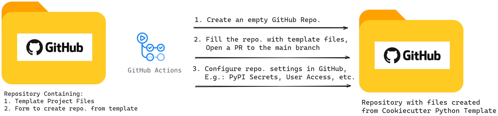
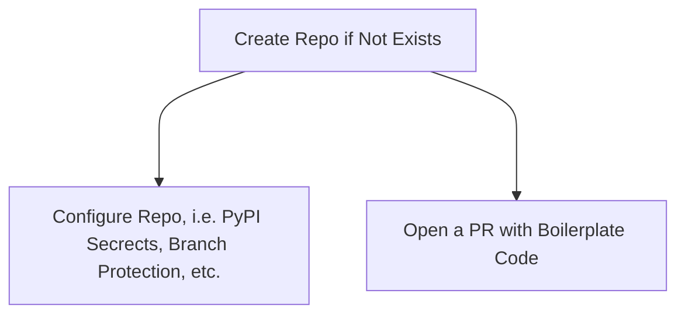

# Python Cookiecutter Project Template

## Overview

This project provides a tool to generate Python project templates using Cookiecutter, GitHub CLI, and GitHub Actions CI/CD. It automates the setup of a new Python package/project using modern, industry-standard tools and practices. It includes a comprehensive setup for linting, testing, continuous integration, and more. The template is fully customizable and can be adapted to fit your specific needs.

## Features

- **Automated Repository Creation**: Generates a new GitHub repository with the necessary boilerplate code.

    ```bash
    .
    ├── Makefile
    ├── README.md
    ├── pyproject.toml
    ├── run.sh
    ├── src
    │   └── package_import_name/
    ├── tests
    │   ├── __init__.py
    │   ├── conftest.py
    │   ├── consts.py
    │   ├── fixtures/
    │   ├── functional_tests/
    │   └── unit_tests/
    └── version.txt
    ```

- **Customizable Configuration**: Allows specifying repository name, visibility (public/private), package import name, upserting PyPI Secrets.
- **Pre-configured Setup**: Includes configuration files like `pyproject.toml`, `.gitignore`, `Makefile`, `.vscode` settings, etc.
- **CI/CD Integration**: Incorporates a GitHub Actions workflow for linting, testing, and building the package.
- **Secrets Management**: Automatically sets up PyPI tokens for publishing packages.
- **VS Code Integration:**: Includes settings for VS Code to ensure a consistent development experience.
    - Auto-completion, Syntax highlighting
    - Auto-formatting on save
    - Linting error detection
    - Test discovery and execution

## Usage

1. **Fork the repository to your GitHub account.**
2. **Optional:** If you intent to publish the package to PyPI, create a PyPI token and add it as a secret to the repository. The secret should be named as `PROD_PYPI_TOKEN` and `PROD_PYPI_TOKEN` for production and test PyPI tokens respectively.
3. **Run the Workflow**: Trigger the GitHub Actions workflow(`Create or Update Repo`) via the GitHub UI.
4. **Fill the Form**: Provide the necessary inputs such as repository name and package import name.
5. **Review and Merge**: A pull request will be created with the generated boilerplate code. Review and merge it to start using your new project setup.

## Benefits

- **Saves Time**: Automates repetitive setup tasks for new Python projects.
- **Ensures Best Practices**: Pre-configured with industry-standard tools and practices.
- **Customizable**: Easily adapt the template to fit your specific needs.


## Quick Local Start Guide for Development

```bash
# Install cookiecutter into an isolated virtual environment
python -m venv ./venv/
source ./venv/bin/activate
pip install --upgrade pip
pip install cookiecutter

# cookie cut the template, answering the prompts, e.g.
#  - repo_name: my-awesome-package
#  - package_import_name: my_awesome_package
cookiecutter https://github.com/avr2002/python-cookiecutter-template.git
```


## Tools & Practices used in the Project


## Project Architecture




This project consists of a tool designed to generate GitHub repositories pre-configured with all necessary files and settings to streamline Python development. The architecture involves two main repositories and uses several key tools.

## Repositories

1. [**Python Cookiecutter Template**](https://github.com/avr2002/python-cookiecutter-template.git): This repository contains template files for generating new Python project repositories.
   - **Template Files**: Include `Makefile`, `.pre-commit-config.yaml`, `pyproject.toml`, source(`src/`) and `tests/` folders, and more.
   - **Placeholders**: Uses placeholders (e.g., `{{ cookiecutter.repo_name }}`) for project-specific values that will be populated during repository generation.

2. **Generated Repositories**: Created using the template from the Cookiecutter repository, these repositories are pre-configured with all necessary files and settings.

## Process

1. **Repository Creation**: A GitHub Actions workflow triggers the creation of an empty repository on GitHub.
2. **File Generation**: The workflow populates the template files with project-specific values provided through a form.
3. **Commit and PR**:
   - The populated files are committed to a new branch in the generated repository.
   - A pull request (PR) is automatically opened from this branch to the main branch.
4. **CI/CD**: The presence of a GitHub Actions workflow file in the PR triggers a build, running linting and tests to ensure the configuration works correctly.
5. **Repository Configuration**: Additional configurations, such as setting PyPI secrets and user access, are automated using GitHub's API.

## Tools Used

1. **Cookiecutter**: A framework for creating project templates. It uses placeholders to generate files with project-specific values.
2. **Jinja**: A templating engine used by Cookiecutter for string substitution in files and filenames.
3. **GitHub CLI**: A command-line tool for interacting with GitHub, allowing automation of repository creation, secret setting, and other tasks.
4. **Pytest**: A testing framework for Python. The project uses an advanced pytest plugin for running tests in parallel, enhancing test efficiency.
5. **SetupTools**: A package development tool that simplifies the process of packaging and distributing Python projects.
6. **Linting Tools**: Includes `flake8`, `autoflake`,  `black`, `isort`, `black`, `mypy`, `radon`, `ruff`, `pytest`, `pytest-cov`, and `pre-commit` for ensuring code quality and consistency.

## Workflow Summary

- **Form Submission**: Users fill out a form to provide details for the new repository.
- **Workflow Execution**: The GitHub Actions workflow handles repository creation, file generation, and initial PR creation.
- **Automated Testing**: The generated repository undergoes automated testing to ensure all configurations are correct.




## Folder Structure

```bash
.
├── Makefile
├── README.md
├── assets/
├── cookiecutter.json
├── pyproject.toml
├── requirements.txt
├── run.sh
├── tests
│   ├── conftest.py
│   ├── consts.py
│   ├── fixtures
│   │   └── project_dir.py
│   ├── functional_tests
│   │   ├── test_cookiecut_generate_project.py
│   │   └── test_makefile.py
│   └── utils
│       ├── __init__.py
│       └── project.py
├── version.txt
└── {{cookiecutter.repo_name}}/
    ├── all the boilerplate code is here
```

* **


✍🏼 [Amit Vikram Raj](https://www.linkedin.com/in/avr27/)
